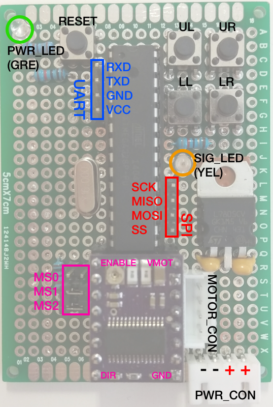

Stepper-Tester
===
A stepper motor tester build with through hole components and prototype board.

An arduino-like circuit (Atmega328p) drives Pololu compatible stepper motor drivers.

Features
===

+ One full revolution rotation
+ Continue rotation
+ Change direction
+ 4-level speed change
+ 3 settings for different motor/system setup (belt, leadscrew, geared)

Operation Manual
===

Inset power cord (under 50V, please also relate to the stepper motor driver voltage limits that you inserted in the tester beforehand). Green indicator will lights up, followed by yellow one. When yellow LED fully lights up, you have 2 seconds to choose your motor/system setup.

+ If UL button is pressed after yellow LED lights up, belt system setting will be applied, and yellow LED will flash twice.
+ If UR button is pressed after yellow LED lights up, leadscrew system setting will be applied, and yellow LED will flash thrice.
+ If no button is pressed after yellow LED lights up, geared system setting will be applied as default, and yellow LED will flash only once.

After the yellow LED flashed according to the settings, motor can be drived in following way:

+ Press UL button once, motor will rotate a full revolution.
+ Press and hold UR button, motor will continue rotate as along as you hold it.
+ Press LL button once, motor rotation direction will change.
+ LR button can be used to choose the rotation speed between 4 levels [*see table below*] (Yellow LED will flash to indicate which speed level you chose to use)

| Sys. Setup | Default Hardware    | Speed (mm/s)    |
| :--------: |:-------------------:| :--------------:|
| Belt       | 2GT-16T             | 20, 40, 80, 300 |
| Leadscrew  | T8r                 | 1, 2, 3, 4      |
| Geared     | 4:1 ratio           | 5, 10, 20, 30   |
|            |                     |                 |
| **Motor**  | **400 steps/rev**   | -               |
| **Driver** | **1/32 microsteps** | -               |

[Platonics Oy](http://platonics.fi)